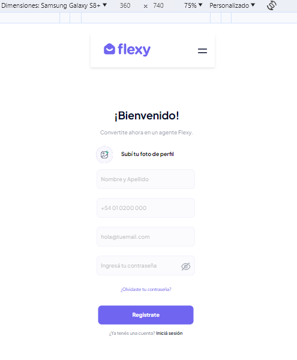

# DELSUD - FLEXY

La prueba técnica realizada para la empresa DELSUD consistió en el desarrollo del frontend de una página de registro, siguiendo el diseño proporcionado a través de Figma. Figma es una herramienta de diseño de interfaz de usuario que permite a los diseñadores crear prototipos interactivos y compartir diseños de manera colaborativa.

Aquí hay un resumen de los pasos y actividades realizadas durante la prueba técnica:

- Recepción del diseño: Se recibió un diseño detallado de la página de registro a través de Figma. Este diseño incluyó elementos como la disposición de los campos del formulario, estilos de botones, colores, tipografías y otros detalles visuales. Link: https://www.figma.com/file/j7PhhMDHi83NosWXWTt2PU/Prueba-t%C3%A9cnica?type=design&node-id=0-1&t=71ZmClGXf9ACJn6d-0

Figma:

- Análisis del diseño: Se llevó a cabo un análisis detallado del diseño para comprender completamente los requisitos y las especificaciones. Esto incluyó la identificación de componentes, diseño responsivo y cualquier interacción especial requerida.

- Desarrollo del Frontend: Utilizando las tecnologías y herramientas necesarias HTML, CSS, JavaScript y React, se procedió a traducir el diseño de Figma en código funcional. Esto implicó la creación de la estructura HTML, la aplicación de estilos CSS y la implementación de las funcionalidades interactiva. (No se utilizaron bibliotecas ya que suma más puntos hacerlo sin ellas).

Resultado:

- Adaptación a dispositivos: Se aseguró de que la página de registro fuera completamente funcional y visualmente atractiva en diversos dispositivos y tamaños de pantalla. Esto puede implicar el uso de diseño responsivo y pruebas en diferentes navegadores.

Resultado: 

  

- Integración de funcionalidades: El diseño requería funcionalidades específicas (por ejemplo, validación de formularios, interacciones en tiempo real, etc.), se implementaron de acuerdo con las especificaciones proporcionadas.

Resultado: 

 

- Pruebas y Depuración: Se realizaron pruebas exhaustivas para asegurarse de que la página de registro funcionara correctamente y se depuraron posibles problemas o errores.

- Entrega y Comunicación: Una vez completado el desarrollo, se entregó el código y el link del deploy.

- Documentación: Se proporcionó documentación adicional, para aportar mejoras como Diseñador UX/UI.

La prueba técnica fue una oportunidad para demostrar habilidades en desarrollo frontend al seguir fielmente un diseño proporcionado y garantizar que la página de registro cumpliera con los estándares de calidad y funcionalidad esperados por DELSUD.